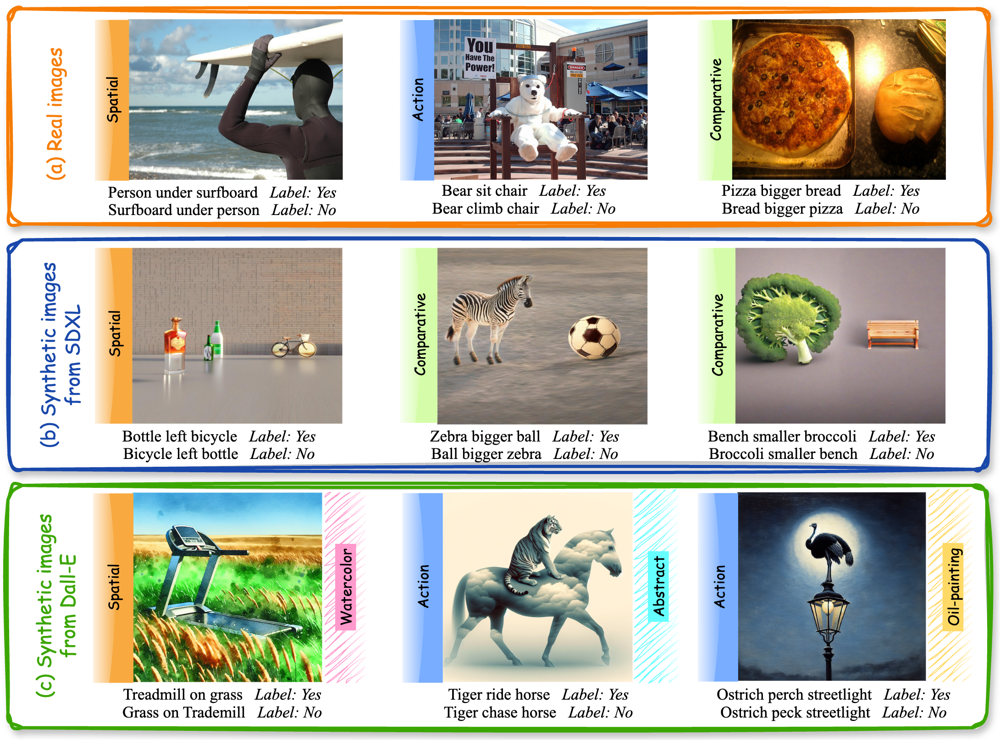

<div align="center">
  
</div>

# MMRel: A Relation Understanding Benchmark in the MLLM Era
[](https://arxiv.org/pdf/2406.09121)<a href="https://huggingface.co/papers/2410.15926"></a> <a href='https://huggingface.co/datasets/jiahaonie/MMRel'></a> <a href='https://niejiahao1998.github.io/MMRel/'></a>

The official repo of "MMRel: A Relation Understanding Benchmark in the MLLM Era". MMRel is a <ins>**large-scale, high-quality, and diverse multi-modal**</ins> benchmark for studying inter-object relations with MLLM.

A brief introduction is in the [HOMEPAGE](https://niejiahao1998.github.io/MMRel/), and more detailed information is in the [PAPER](https://arxiv.org/pdf/2406.09121).

The MMRel download links are descrbed below.

 Authors: [Jiahao Nie<sup>*</sup>](https://scholar.google.com/citations?user=LGM10RQAAAAJ&hl=zh-CN&inst=8669986779262753491&oi=ao), [Gongjie Zhang<sup>*</sup>](https://scholar.google.com/citations?user=sRBTPp4AAAAJ&hl=zh-CN&inst=8669986779262753491&oi=ao), [Wenbin An](https://scholar.google.com/citations?user=BpkQZGgAAAAJ&hl=zh-CN&inst=8669986779262753491&oi=ao), [Yap-Peng Tan](https://scholar.google.com/citations?user=t9EqYQIAAAAJ&hl=zh-CN&inst=8669986779262753491&oi=ao)</a>, [Alex C. Kot](https://scholar.google.com/citations?user=UGZXLxIAAAAJ&hl=zh-CN&inst=8669986779262753491&oi=ao), [Shijian Lu](https://scholar.google.com/citations?user=uYmK-A0AAAAJ&hl=zh-CN&inst=8669986779262753491&oi=ao)

<p align="middle">
    
</p>


## Download

### Real images and images sythestized from SDXL
The real images are from [Visual Genome](https://homes.cs.washington.edu/~ranjay/visualgenome/index.html).
The images sythestized from SDXL can be download from [SPEC](https://github.com/wjpoom/SPEC)'s official repo. Specifically, we adopt the *realtive_spatial* and *relative_size* subsets.

### Images synthesized from Dall-E
To diversity the MMRel, we specifally sythesize images via Dall-E. Moreover, we create a challenging subset in MMRel which utilizes relations that deviate from common sense to assess the relation understanding capabilities of MLLMs rigorously. The images from Dall-E are with different four styles (*i.e.*, photo-realistic, watercolor, abstract, and oil painting).

### The images generated from Dall-E
Our released Dall-E synthetic image can be download from [Hugging Face](https://huggingface.co/datasets/jiahaonie/MMRel).


### Question-Answer pairs for evaluation and fine-tuning
Our released QA pairs can be download from [Hugging Face](https://huggingface.co/datasets/jiahaonie/MMRel).


## Citation
If you use this codebase for your research, please consider citing:
```bash
@article{nie2024mmrel,
  title={MMRel: A Relation Understanding Benchmark in the MLLM Era},
  author={Nie, Jiahao and Zhang, Gongjie and An, Wenbin and Tan, Yap-Peng and Kot, Alex C and Lu, Shijian},
  journal={arXiv preprint arXiv:2406.09121},
  year={2024}
}
 ```

## Acknowledgement
Our experiments are conducted based on [LLaVA-1.5](https://github.com/haotian-liu/LLaVA) and [VCD](https://github.com/DAMO-NLP-SG/VCD)'s official code.

## Reference
[1] Haotian Liu, Chunyuan Li, Qingyang Wu, and Yong Jae Lee. Visual Instruction Tuning. NeurIPS, 2023

[2] Haotian Liu, Chunyuan Li, Yuheng Li, and Yong Jae Lee. Improved Baselines with Visual Instruction Tuning. arXiv:2310.03744, 2023.

[3] Sicong Leng, Hang Zhang, Guanzheng Chen, Xin Li, Shijian Lu, Chunyan Miao, and Lidong Bing. Mitigating Object Hallucinations in Large Vision-Language Models through Visual Contrastive Decoding. CVPR, 2024.

[4] Ranjay Krishna, Yuke Zhu, Oliver Groth, Justin Johnson, Kenji Hata, Joshua Kravitz, Stephanie Chen, Yannis Kalantidis, Li-Jia Li, David A. Shamma, Michael S. Bernstein, and Fei-Fei Li. Ranjay Krishna, Yuke Zhu, Oliver Groth, Justin Johnson, Kenji Hata, Joshua Kravitz, Stephanie Chen, Yannis Kalantidis, Li-Jia Li, David A. Shamma, Michael S. Bernstein, Fei-Fei Li. IJCV, 2017.

[5] Wujian Peng, Sicheng Xie, Zuyao You, Shiyi Lan, and Zuxuan Wu. Wujian Peng, Sicheng Xie, Zuyao You, Shiyi Lan, Zuxuan Wu. CVPR, 2024.